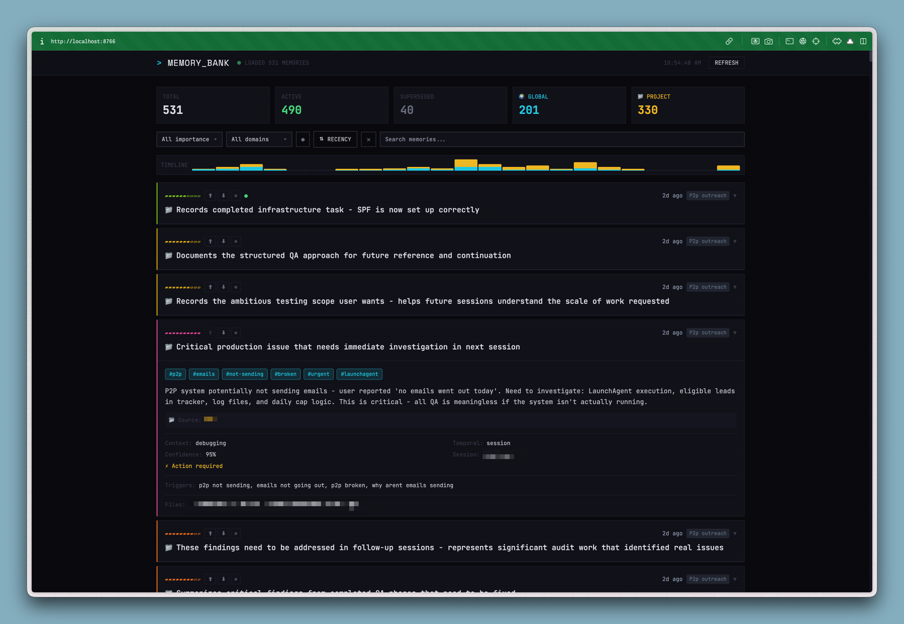

# Memory dashboard

A terminal-aesthetic dashboard for visualizing and curating [memory-ts](https://github.com/RLabs-Inc/memory-ts) memories.



## Features

- **Visual memory browser** - See all your memories with importance bars, timestamps, and semantic tags
- **Promote/demote** - Adjust memory importance with ⬆⬇ buttons (uses PATCH endpoint from v0.4.15+)
- **Bury/unbury** - Hide irrelevant memories from retrieval without deleting
- **Filter by scope** - Global vs project-level memories
- **Filter by type** - Memory types (breakthrough, decision, technical, etc.)
- **Filter by importance** - High/medium/low priority views
- **Search** - Full-text search across memory content
- **Sort toggle** - Switch between recency and importance sorting
- **Memory diff** - Compare current vs previous snapshots to see what changed

## Requirements

- [memory-ts](https://github.com/RLabs-Inc/memory-ts) v0.4.15+ running locally
- A modern browser

## Usage

1. Start memory-ts server (default: `http://localhost:8765`)
2. Open `index.html` in your browser
3. The dashboard auto-connects and loads your memories

That's it. Single HTML file, no build step, no dependencies to install.

## Design

Terminal aesthetic inspired by retro CRTs:
- JetBrains Mono font throughout
- Scanline overlay effect
- Cyan for global memories, amber for project-level
- 10-level importance gradient with color-coded bars
- Dark background (#0a0a0f) with subtle glow effects

## Configuration

The API endpoint is hardcoded to `localhost:8765`. If your memory-ts runs elsewhere, edit line ~683 in `index.html`:

```javascript
const MEMORY_API = 'http://localhost:8765';
```

## License

MIT
